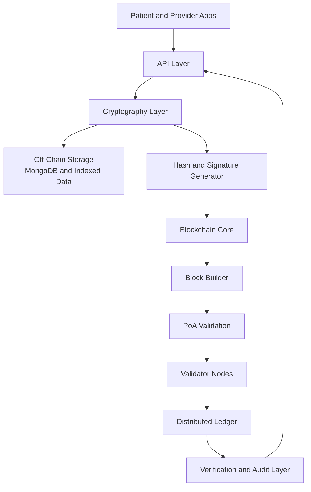

# MyHealthMirrorChain Protocol Architecture

This document describes the system architecture of MyHealthMirrorChain Protocol, a hybrid blockchain platform for secure, verifiable, and patient-controlled healthcare data.

---

## 1. Architecture Goals

The architecture is designed to satisfy the following goals:

1. Data integrity with tamper-evident verification
2. Privacy-first handling of sensitive healthcare records
3. Scalability for high-volume clinical workflows
4. Interoperability across healthcare providers and applications
5. Auditability for compliance and governance

---

## 2. High-Level System View

The protocol uses a hybrid architecture:

1. Off-chain storage holds encrypted medical payloads
2. On-chain ledger stores hashes and audit events
3. API and cryptography layers bridge application and trust domains

---

## 3. Layered Architecture

### 3.1 Client Layer

Responsibilities:

1. Patient and provider-facing workflows
2. Record submission and retrieval requests
3. Signature-based identity and request authorization

Key assets:

1. User identities and signing keys
2. Access intents and consent metadata

### 3.2 API Layer

Responsibilities:

1. Authentication and authorization enforcement
2. Input validation and schema conformance
3. Request orchestration across cryptography, storage, and chain modules
4. Audit event emission for sensitive operations

Typical modules:

1. `packages/api/routes`
2. `packages/api/controllers`
3. `packages/api/services`
4. `packages/api/middleware`

### 3.3 Cryptography Layer

Responsibilities:

1. Encryption and decryption of medical payloads
2. Hash computation for integrity proofs
3. Digital signature creation and verification
4. Key lifecycle support

Algorithms:

1. AES-256 for record encryption
2. SHA-256 for deterministic hashing
3. ECDSA for signatures and identity verification

Typical modules:

1. `packages/cryptography/encryption`
2. `packages/cryptography/hashing`
3. `packages/cryptography/signatures`
4. `packages/cryptography/key-management`

### 3.4 Off-Chain Storage Layer

Responsibilities:

1. Persist encrypted medical data and metadata
2. Support indexed retrieval and query operations
3. Enforce data retention and deletion policies

Principles:

1. Store encrypted payloads only
2. Never persist plaintext PHI in operational stores
3. Keep data model decoupled from on-chain consensus state

Typical modules:

1. `packages/storage/offchain/models`
2. `packages/storage/offchain/repositories`
3. `packages/storage/offchain/services`

### 3.5 Blockchain Core Layer

Responsibilities:

1. Manage block structure and chain state
2. Execute consensus validation and append blocks
3. Provide tamper-evident verification for records

Stored on-chain:

1. Record hashes
2. Integrity and verification events
3. Minimal metadata required for auditability

Not stored on-chain:

1. Raw medical records
2. Direct PHI payloads

Typical modules:

1. `packages/core/block`
2. `packages/core/blockchain`
3. `packages/core/consensus`
4. `packages/core/state`
5. `packages/core/validation`

### 3.6 Network Layer

Responsibilities:

1. Validator node communication
2. Block and transaction propagation
3. Peer discovery and synchronization

Typical modules:

1. `packages/network/p2p`
2. `packages/network/gossip`
3. `packages/network/peer-discovery`
4. `packages/network/protocols`

---

## 4. Core Data Flows

### 4.1 Record Creation Flow

1. Client submits medical payload to API
2. API validates schema, access rights, and consent constraints
3. Cryptography layer encrypts payload and computes SHA-256 hash
4. Encrypted payload is stored in off-chain database
5. Hash and verification metadata are sent to blockchain core
6. PoA validators approve block inclusion
7. Ledger stores immutable proof
8. API returns reference and verification status

### 4.2 Record Verification Flow

1. Client requests proof of integrity for a record reference
2. System retrieves encrypted payload and recomputes hash
3. Recomputed hash is compared with on-chain hash
4. Verification result and audit event are returned

### 4.3 Access Audit Flow

1. Access requests are authenticated and authorized
2. Access event is logged off-chain
3. Integrity-critical event summary can be anchored on-chain
4. Auditors retrieve immutable timeline for evidence

---

## 5. Trust Boundaries and Security Zones

The architecture is segmented into security zones:

1. Untrusted zone: external clients and public endpoints
2. Controlled zone: API and service orchestration tier
3. Sensitive data zone: encrypted storage and key-managed operations
4. Trust zone: validator network and ledger consensus

Security controls by boundary:

1. TLS in transit across all service communication
2. Strict authentication and role checks at API ingress
3. Encryption before persistence
4. Signature verification before chain writes
5. Immutable audit trail for high-risk operations

---

## 6. Consensus Model

The protocol uses Proof of Authority (PoA), selected for permissioned healthcare networks.

Characteristics:

1. Validators are known, authorized institutions
2. Faster finality than public proof-of-work networks
3. Lower operational cost and predictable performance

Operational notes:

1. Validator admission and revocation must be governed and auditable
2. Node identities should be hardware-backed where possible
3. Misbehavior handling must include evidence capture and governance actions

---

## 7. Compliance and Privacy Strategy

### 7.1 Data Minimization

1. Store only required metadata on-chain
2. Keep sensitive payloads off-chain and encrypted

### 7.2 Right to Erasure Alignment

1. Off-chain encrypted payload can be deleted on request
2. On-chain hash remains as non-plaintext integrity evidence

### 7.3 Auditability

1. Access and verification events are traceable
2. Ledger provides immutable evidence for integrity checks

---

## 8. Deployment Topology

### 8.1 Logical Topology

1. Application nodes run API and orchestration services
2. Database nodes host encrypted off-chain storage
3. Validator nodes maintain consensus and ledger state
4. Optional observer nodes provide analytics and explorer APIs

### 8.2 Infrastructure Support

1. Docker for containerized local and staging deployments
2. Kubernetes for orchestrated production workloads
3. Terraform for repeatable infrastructure provisioning
4. Centralized monitoring and alerting for operational visibility

---

## 9. Reliability and Performance Considerations

1. Horizontal API scaling behind load balancers
2. Database indexing for high-read medical retrieval patterns
3. Backpressure and queueing for burst traffic
4. Snapshot and backup strategy for chain state and off-chain metadata
5. Disaster recovery procedures for validator and storage tiers

---

## 10. Observability

Minimum observability requirements:

1. Structured logs with request correlation IDs
2. Metrics for API latency, validator health, and block finality
3. Traces for end-to-end record write and verification flows
4. Security telemetry for failed auth, signature mismatch, and policy violations

---

## 11. Risks and Mitigations

1. Key compromise risk
	Mitigation: key rotation, HSM integration, strict secret handling
2. Validator collusion risk
	Mitigation: governance policies, independent institutional validators, monitoring
3. Data leakage risk from off-chain systems
	Mitigation: encryption-by-default, access control, redaction-safe logging
4. API abuse risk
	Mitigation: rate limiting, anomaly detection, strict validation

---

## 12. Future Architecture Evolution

Planned evolution areas:

1. Zero-knowledge proofs for privacy-preserving verification
2. Improved interoperability with healthcare standards such as FHIR
3. Multi-region validator federation
4. Formal verification of critical consensus logic

---

## 13. Summary

MyHealthMirrorChain Protocol architecture separates sensitive payload storage from immutable integrity proofs, enabling healthcare-grade privacy with blockchain-based trust. The hybrid model is designed for practical adoption by healthcare institutions while preserving auditability, scalability, and patient-centric control.
